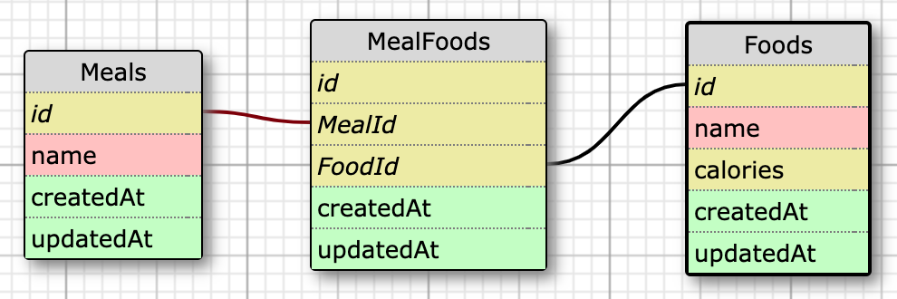

# Quantified Self
This REST API... (TODO) All responses are JSON.

The app is deployed at https://nutritionaltracker.herokuapp.com/.

This project was part of [Turing School of Software & Design](https://turing.io)'s Back End Engineering program (Mod 4). See the project spec [here](https://backend.turing.io/module4/projects/quantified_self/qs_server_side). It was completed in 10 days by [Alexandra Chakeres](https://github.com/chakeresa) and [Ryan Miller](https://github.com/ryanmillergm).

View the project board at https://github.com/ryanmillergm/quantified_self/projects/2.

## Schema


## Tech Stack
 - Framework: Express v4.16.4
 - Language: JavaScript
 - Database: PostgreSQL v7.12.1
 - ORM: Sequelize v5.15.1
 - Testing: Mocha v6.2.0 & Chai v4.2.0

## Other Packages
 - Secure ENV variable storage: dotenv
 - Run server using latest file updates: nodemon
 - Run shell commands: shelljs
 - Make HTTP requests in tests: supertest

## Local Setup
 - `$ git clone git@github.com:ryanmillergm/quantified_self.git`
 - `$ cd quantified_self`
 - `$ npm install`
 - `$ npx sequelize db:create`
 - `$ npx sequelize db:migrate`

## Running the Server Locally
 - `$ npm start` or `$ nodemon`
 - Access endpoints at `http://localhost:3000`

## Running the Test Suite
 - `$ npm test`

## API Endpoints
### List all foods in the database
Request:
```
GET /api/v1/foods
Accept: application/json
```
Example response:
```
Status: 200
Content-Type: application/json
Body:
[
    {
        "id": 1,
        "name": "peas",
        "calories": 10
    },
    {
        "id": 2,
        "name": "candy bar",
        "calories": 300
    }
]
```

## Core Contributors
 - Alexandra Chakeres, [@chakeresa](https://github.com/chakeresa)
 - Ryan Miller, [@ryanmillergm](https://github.com/ryanmillergm)

### How to Contribute
 - Fork and clone the [repo](https://github.com/ryanmillergm/quantified_self)
 - Make changes on your fork & push them to GitHub
 - Visit https://github.com/ryanmillergm/quantified_self/pulls and click `New pull request`
